# Mines and Container Ships

This mod adds several new production buildings and production chains to Anno 117.  The primary benefits are
- *50% Productivity boosts to Mines and Quarries*
- *High-capacity "Container Ships" (6, 9, and 12 cargo slots)*

## Summary:

- Mining Tools Workshop Production Chain:  *Mine and Quarry Productivity Boost, Zinc Ore*
  - Mining Tools Workshop (new production building)
    - Inputs: Iron, Wood
    - Output: AOE buffs
  - AOE buffs to nearby mines and quarries
    - Production boost +50%
    - Additional Product, 1 ton of Zinc Ore (new product) every 8 cycles
- Nautical Workshop Production Chain:  *Corrosion-Resistant Fittings*
  - Brass Smelter (new production building)
    - Inputs: Zinc Ore, Copper Ore
    - Output: Brass Bars (new product)
  - Nautical Workshop (new production building)
    - Inputs: Brass Bars, Obsidian
    - Outputs: Corrosion-Resistant Fittings (new product)
- Improved Shipyards:  *Container Ships*
  - Adds high-capacity "Container Ships" to list of ships that can be fabricated
    - Inputs: Denari, Timber, Ropes, Sails, and Corrosion-Resistant Fittings
    - Configurable modules for Sails, Oars, Hull Plating
  - Penteconter: Up to 6 cargo slots
  - Trireme: Up to 9 cargo slots
  - Quinquereme: Up to 12 cargo slots

## Mining Tools Workshop Production Chain

### Construction menu:

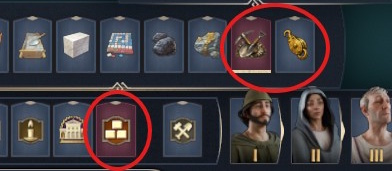

### Production Chain:

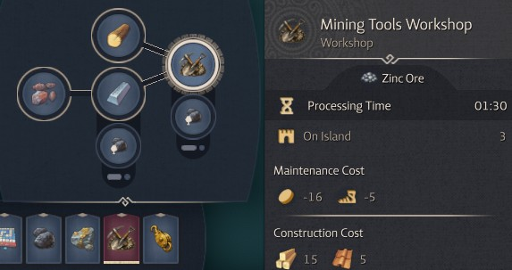

  - Mining Tools Worshop (new production building)
    - Inputs: Iron, Wood
    - Output: AOE buffs to nearby mines and quarries

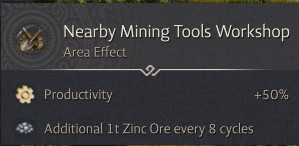

### Zinc Ore:

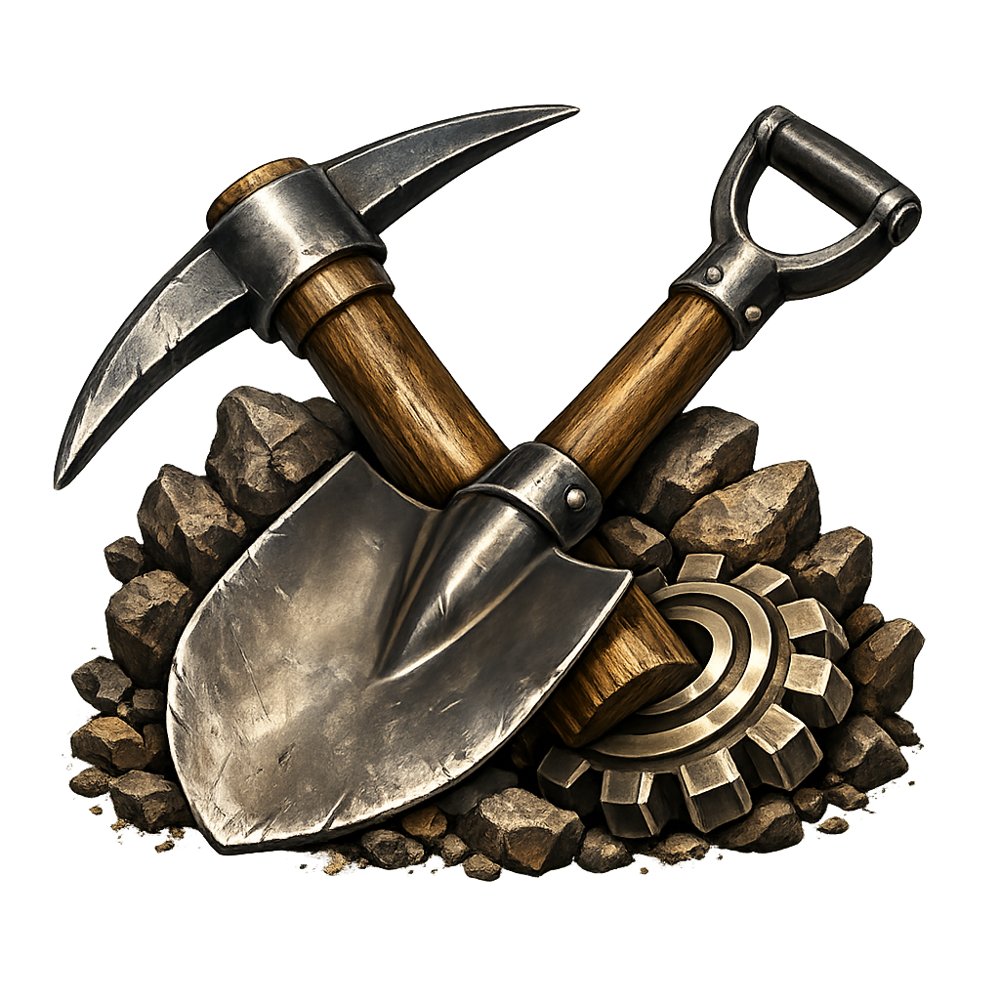
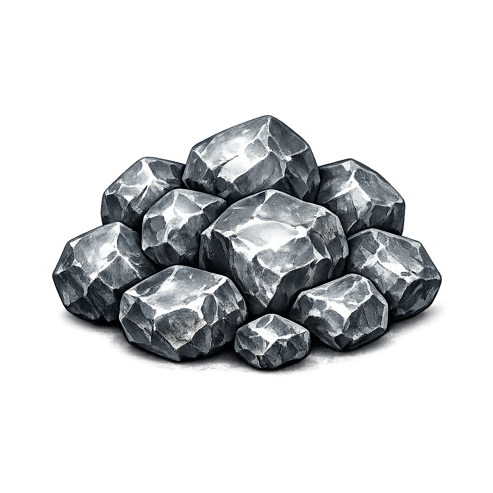

## Corrosion-Resistant Fittings Production Chain

### Construction menu:

### Production Chain:

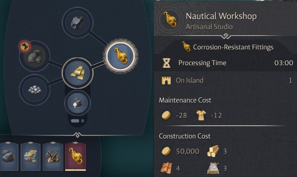

- Nautical Workshop Production Chain:  *Corrosion-Resistant Fittings*
  - Brass Smelter (new production building)
    - Inputs: Zinc Ore, Copper Ore
    - Output: Brass Bars (new product)
  - Nautical Workshop (new production building)
    - Inputs: Brass Bars, Obsidian
    - Outputs: Corrosion-Resistant Fittings (new product)

### Corrosion-Resistant Fittings:

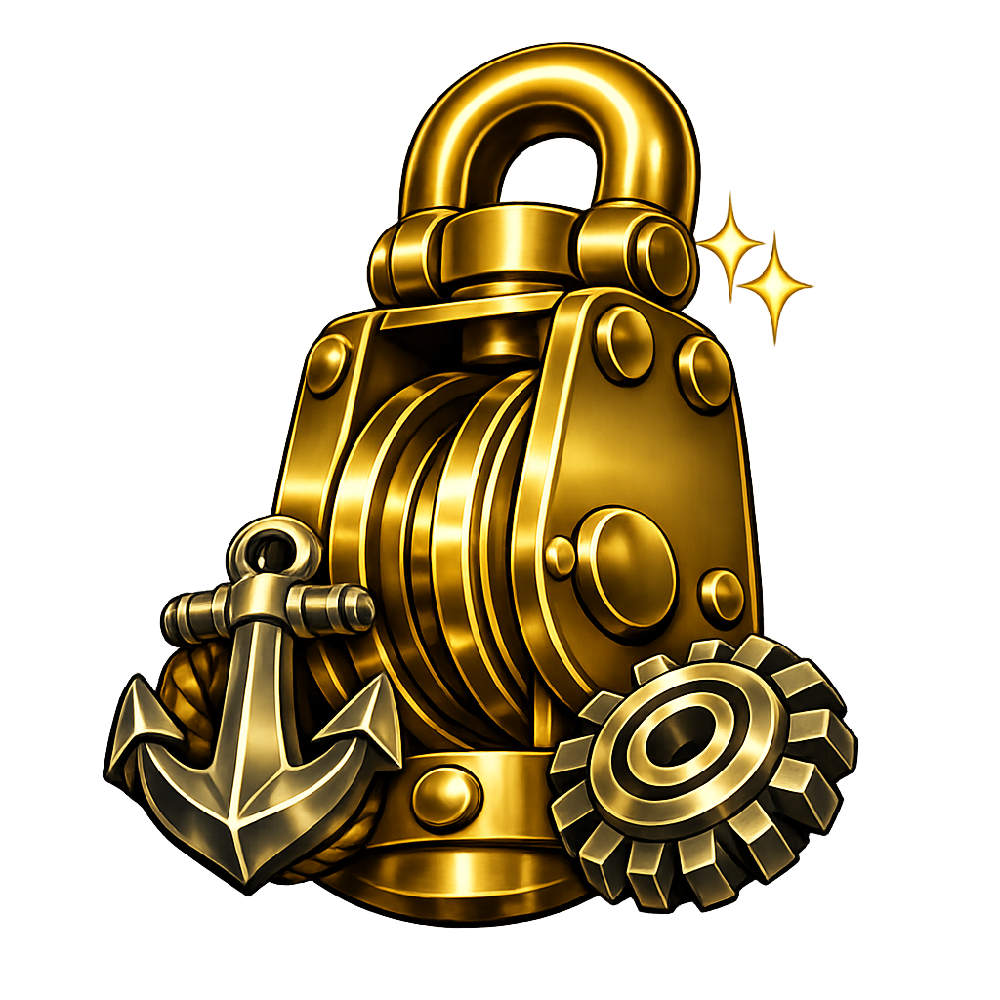

## Improved Shipyards

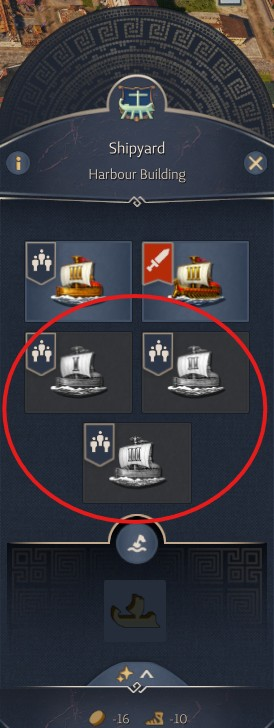

### High-Capacity "Container Ships"

  - Inputs: Denari, Timber, Ropes, Sails, Corrosion-Resistant Fittings
  - Pente: Up to 6 cargo slots
  - Trireme: Up to 9 cargo slots
  - Quinquereme: Up to 12 cargo slots

  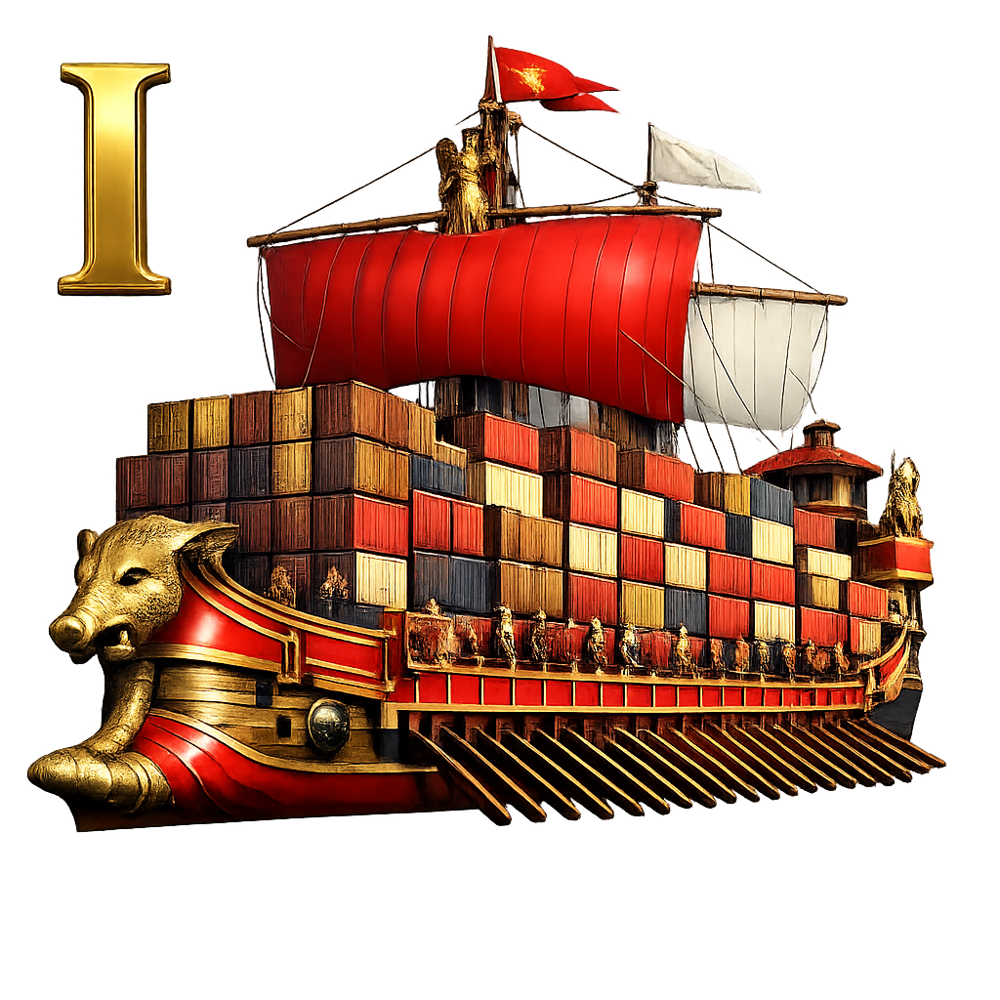
  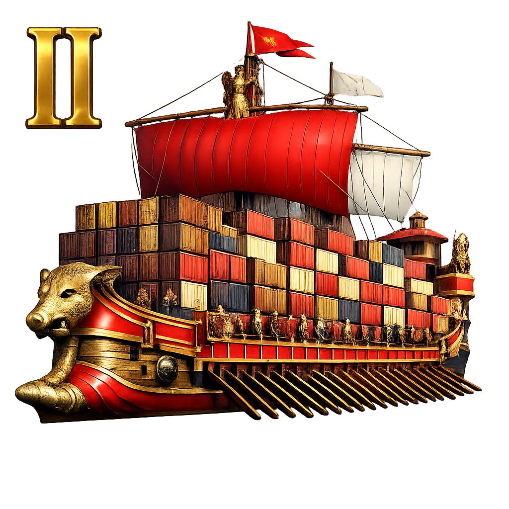
  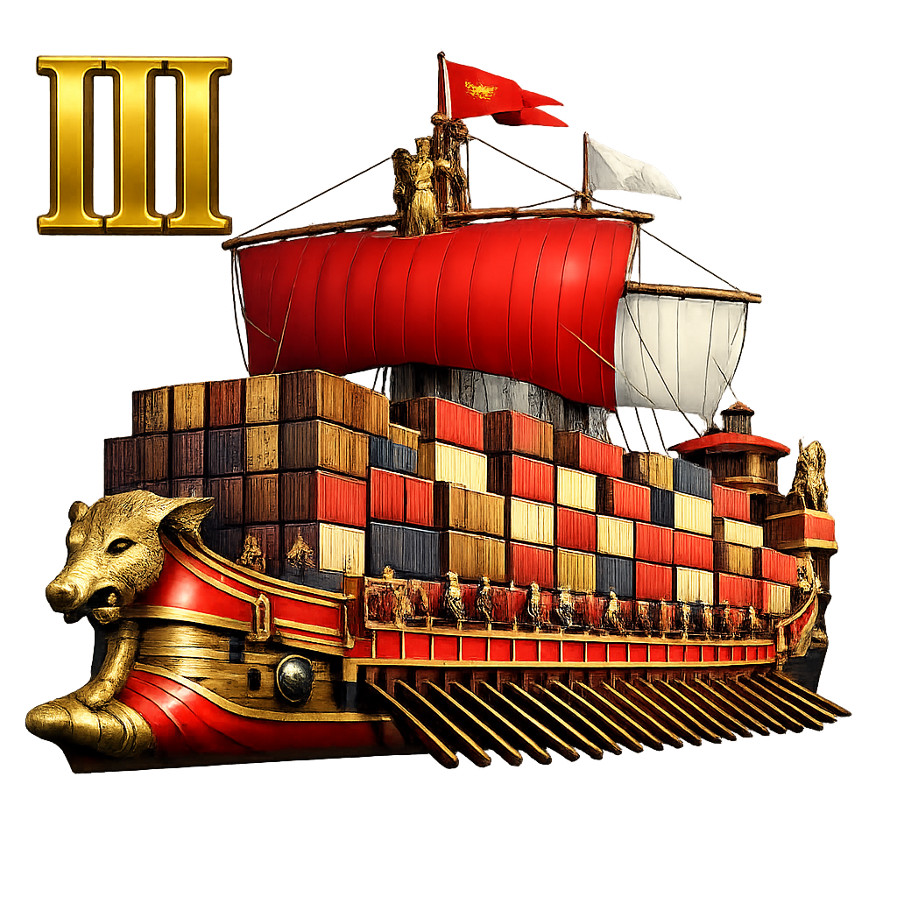
